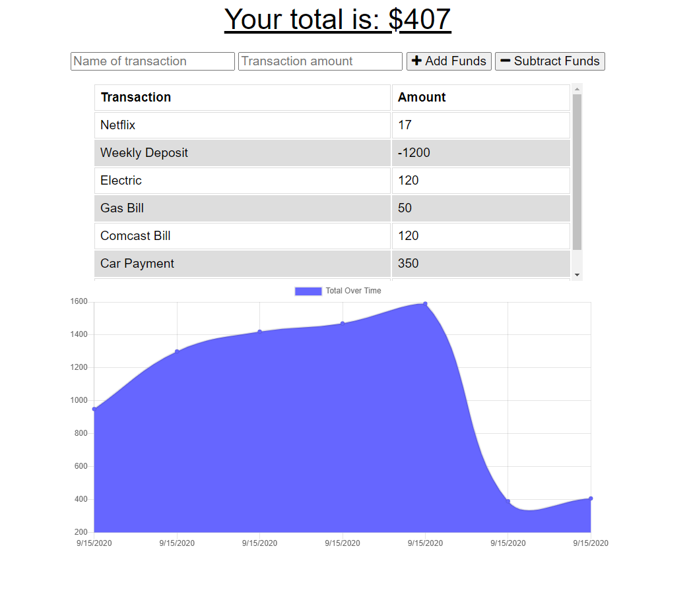

# Online/Offline Budget Trackers
  
  
  
  ### Description

  An app that lets users add expenses and deposits to their budget with or without a connection. When entering transactions offline, they should populate the total when brought back online.

Offline Functionality:

  * Enter deposits offline

  * Enter expenses offline

When brought back online:

  * Offline entries should be added to tracker.

  ### User Story

  * AS AN avid traveller I WANT to be able to track my withdrawals and deposits with or without a data/internet connection SO THAT my account balance is accurate when I am traveling
  
  ### Table of Contents

  * [Installation](#installation)
  * [Usage](#usage)
  * [Contributors](#contributors)
  * [License](#license)
  * [Repository](#Repository)
  * [Questions](#questions)

  ### Installation

  Installation not necessary. App deployed on Heroku.

  ### Usage

  * Open the App.
  * Enter name of transaction.
  * Enter transaction amount.
  * Add or Subtract funds.
  * Graph Will continue to polulate to show change in budget. 

  ### App Screen Shots

  
 
  
  ### Contributors

  

  ### License

  

  ### Repository

  - [Github](https://github.com/EMackPierre/Online-Offline-Budget-Trackers)
  - [Heroku](https://powerful-escarpment-86900.herokuapp.com/)

  ### Questions

  If you have any additional questions you may contact me at https://github.com/EMackPierre

  You may also email me at emmp318@gmail.com